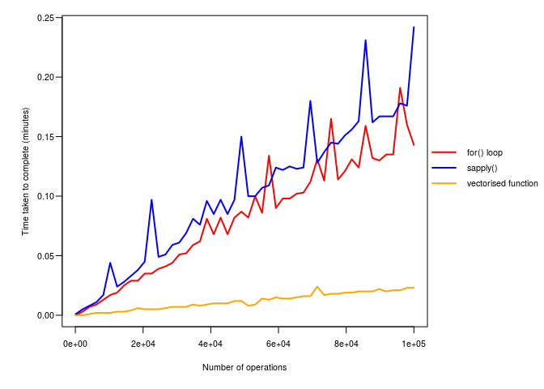

R survival guide (an introduction to the vocabulary and grammar of R)
================

-   [Introduction](#introduction)
-   [Elements and modes](#elements-and-modes)
    -   [Numeric and Integer](#numeric-and-integer)
    -   [Character strings](#character-strings)
    -   [Logical](#logical)
    -   [Special case - Factors](#special-case---factors)
-   [Objects & classes](#objects-classes)
    -   [Vectors](#vectors)
    -   [Matrices](#matrices)
    -   [Arrays](#arrays)
    -   [Lists](#lists)
    -   [Data frames](#data-frames)
    -   [Other objects](#other-objects)
-   [Attributes](#attributes)
-   [The environment](#the-environment)
-   [Operators](#operators)
    -   [Arithmetic operators](#arithmetic-operators)
    -   [Assignment operators](#assignment-operators)
        -   [Comparison operators](#comparison-operators)
        -   [Logic operators](#logic-operators)
-   [Object exploration](#object-exploration)
    -   [Summarising functions](#summarising-functions)
    -   [Subsetting](#subsetting)
        -   [Extract by indexing: \[\]](#extract-by-indexing)
        -   [Names](#names)
        -   [Logical vectors](#logical-vectors)
        -   [Extract by name: $](#extract-by-name)
        -   [Deep extract: \[\[\]\]](#deep-extract)
-   [Data manipulation](#data-manipulation)
    -   [Coercing elements into different modes](#coercing-elements-into-different-modes)
        -   [Coercing to 'numeric'](#coercing-to-numeric)
        -   [Coercing to 'character'](#coercing-to-character)
        -   [Coercing to logical](#coercing-to-logical)
        -   [Coercing to factor.](#coercing-to-factor.)
    -   [Coercing objects into different classes](#coercing-objects-into-different-classes)
-   [Combining, matching and merging](#combining-matching-and-merging)
    -   [Combining objects together](#combining-objects-together)
    -   [Matching](#matching)
    -   [Merging objects](#merging-objects)
-   [Functions](#functions)
    -   [Working with in-built functions](#working-with-in-built-functions)
    -   [Basic user-defined functions](#basic-user-defined-functions)
    -   [Conditional statements (If)](#conditional-statements-if)
    -   [Custom operators](#custom-operators)
-   [Iterative programming](#iterative-programming)
    -   [Apply functions](#apply-functions)
    -   [Vectorising](#vectorising)
-   [Construction space](#construction-space)

Introduction
============

The point of this tutorial is to get you familiar with some of the language of R, and some of the basic ways to create and manipulate objects. My aim is to get you to the point where you know enough R to solve your own problems and self-teach yourself anything you need to know. It's hard, don't get down about it. R is not a user-friendly skill to pick up, and it's not intuitive to most people. Keep at it, and you'll be rewarded...I think. I'll let you know when it happens!

Elements and modes
==================

Elements are the basic unit of R objects. Think of them like atoms, or letters. Everything larger is built up of elements.

Every element has a mode. This is what type of element you have, and how R stores it and reads it. The most common ones for data are 'numeric', 'integer', 'character' and 'logical'. There are freaky ones you're not likely to see as well, so don't let the help pages terrify you.

There's also some overlap between what is considered a 'mode' and what is considered a class, and it gets very confusing. I go a little off-piste and use 'mode' to refer to the element type, and 'class' to refer to object type. To decode that from R-speak, for me, 'class' refers to structure of the object, and 'mode' refers to what type of data the object is made up of. But we'll get to objects in a moment.

*Some important help pages: ?mode, ?typeof, ?numeric, ?character, ?logical, ?factor*

Numeric and Integer
-------------------

Integers are a special case with just whole numbers, and as a general rule, just think of them as numeric. Numeric mode contains numbers, in a stunning defiance of expectations.

``` r
mode(3)
```

    ## [1] "numeric"

Character strings
-----------------

Strings are treated as text, regardless of whether the values are actually numbers.

``` r
mode("b")
```

    ## [1] "character"

``` r
mode("3")
```

    ## [1] "character"

Logical
-------

The logical mode is boolean, which means it has value of 1 (TRUE), or 0 (FALSE). NAs, placeholders for missing data, are also considered logical. Logical modes can be treated like numbers.

``` r
mode(TRUE)
```

    ## [1] "logical"

``` r
mode(FALSE)
```

    ## [1] "logical"

``` r
mode(NA)
```

    ## [1] "logical"

Special case - Factors
----------------------

Factors aren't strictly a mode but they're important enough to look at now. Factors are weird because they look like strings, but are actually coded as numbers. The way it works is every unique value becomes a factor level, with a reference number. R squirrels away a table with the factor levels and reference numbers, and the factor elements are coded as the reference numbers. When you go to look at the factor, R uses the table to substitute in the factor levels.

You'll notice below that the 'mode' of a factor is actually 'numeric', which refers to the reference numbers that R keeps as the actual values for the factor. R conveniently forgets to mention the reference table when you ask it what mode the factor is. It's more honest when you ask what class the factor is though.

``` r
mode(factor(3))
```

    ## [1] "numeric"

``` r
mode(factor("red"))
```

    ## [1] "numeric"

``` r
class(factor("red"))
```

    ## [1] "factor"

Objects & classes
=================

An object is anything in R that has a name that you can call. This isn't a particularly useful definition, but it's all-encompassing. Objects have a 'class', which tells R how to treat the object. Like I said before, 'classes' and 'modes' get a bit blurry in the middle. The most common classes are 'vector', 'array', 'matrix', 'data.frame' and 'list'. Every function you use has a class of 'function'. There's also weird ones, have a look at ?class.

Vectors
-------

Vectors are the most basic R object. They're a list of elements, and have no special characteristics. R doesn't give them a 'class', instead they get a class that's the same as their mode. Every element in a vector has to have the same mode. See how these terms stack up really quickly!

*Helpful help pages: ?vector*

``` r
number.vect<-c(1,2,3)
class(number.vect)
```

    ## [1] "numeric"

``` r
mode(number.vect)
```

    ## [1] "numeric"

``` r
str(number.vect)
```

    ##  num [1:3] 1 2 3

You can have a vector of any mode we've already discussed.

``` r
string.vect<-c("A","B","C")
class(string.vect)
```

    ## [1] "character"

``` r
log.vect<-c(TRUE, TRUE, FALSE)
class(log.vect)
```

    ## [1] "logical"

``` r
fact.vect<-factor(c(1,1,2))
class(fact.vect)
```

    ## [1] "factor"

Vectors have a length, but don't have any formal dimensions, they just go from start to finish.

``` r
length(number.vect)
```

    ## [1] 3

``` r
dim(number.vect)
```

    ## NULL

Vectors can also be empty, which can be useful if you want to add data a bit at a time (see our section on loops)

``` r
empty.vect<-vector(mode="numeric")
empty.vect
```

    ## numeric(0)

``` r
length(empty.vect)
```

    ## [1] 0

Matrices
--------

A matrix is a vector with 2 dimensions. Instead of just being a big long list of elements, the matrix has row and column numbers, which tell R where to break the elements up onto different rows. Because matrices are a single list of elements, like a vector, matrix elements must all be of the same mode.

*Helpful help pages: ?matrix*

``` r
number.mat<-matrix(1:10, nrow=5)
class(number.mat)
```

    ## [1] "matrix"

``` r
mode(number.mat)
```

    ## [1] "numeric"

``` r
str(number.mat)
```

    ##  int [1:5, 1:2] 1 2 3 4 5 6 7 8 9 10

The length of a matrix is the total number of values. The dimensions are how many rows and columns the matrix has (in that order).

``` r
length(number.mat)
```

    ## [1] 10

``` r
dim(number.mat)
```

    ## [1] 5 2

You can make a matrix with any mode except a factor. Factor matrices default to a mode of 'character'. I can't think of any reason you'd want a factor matrix anyway.

``` r
string.mat<-matrix(letters[1:10], nrow=5)
mode(string.mat)
```

    ## [1] "character"

``` r
log.mat<-matrix(c(rep(TRUE, 5), rep(FALSE, 5)), nrow=5)
mode(log.mat)
```

    ## [1] "logical"

``` r
factor.mat<-matrix(factor(1:10), nrow=5)
mode(factor.mat)
```

    ## [1] "character"

Arrays
------

Array is a catch-all name for any object full of one mode of elements, with N-dimensions. A 2D array is a matrix. The most useful ones are 1D arrays, which are essentially a 1-row matrix. These are just vectors that have a formal dimension. In my head it's easier to think of vectors and 1-row matrices, rather than bring in a whole new object type, but help files often talk about arrays, so its' good to know what they are.

3-dimensional arrays are also useful, where you have a number of 'matrix slices' joined together into a giant matrix meatloaf. Beyond 3 dimensions, my head starts to hurt, but you can have an array with as many dimensions as you like.

``` r
row.mat<-as.array(number.vect)
class(row.mat)
```

    ## [1] "array"

Lists
-----

Lists are super useful, but all my introductory R courses avoided them. They're not even particularly complex. A list is basically just a vector. The difference is this: A vector is a vector of elements, a list is a vector of objects. I've mentioned a few times that some of our terminology is a little muddy. Here's an example of where things get a little crazier.

``` r
list1<-list(number.vect, 
            string.vect, 
            log.vect, 
            fact.vect)
class(list1)
```

    ## [1] "list"

``` r
mode(list1)
```

    ## [1] "list"

``` r
str(list1)
```

    ## List of 4
    ##  $ : num [1:3] 1 2 3
    ##  $ : chr [1:3] "A" "B" "C"
    ##  $ : logi [1:3] TRUE TRUE FALSE
    ##  $ : Factor w/ 2 levels "1","2": 1 1 2

Because each list element is its own object, each one can have its own mode! So you can mix together numbers and strings and factors. We'll come back to this when we get to subsetting, but this is a super useful way to store objects that are related to eachother.

List elements don't even have to be the same length, because each of them is an object in its own right!

``` r
list2<-list(number.vect,
            1,
            1:20)
```

Data frames
-----------

You're probably wondering why I left data frames to last, considering they're probably the most common object for classic scientific analysis. You probably learnt how to read in a .csv file as a data-frame and get cooking. Data-frames are last because they look like they're closely related to a matrix (2D data, row and column numbers etc), but they're actually a special version of a list. Data-frames are lists where each list element (each object in the list) has the same length, and R shows it to you in a more user-friendly format. This doesn't mean much now, but it's important when we start using functions down the line.

``` r
names(list1)<-1:4 # adding some names to our list (see attributes section). This
                  # is just so our data.frame doesn't end up with weird column names
data1<-data.frame(list1) # we can make it into a data frame
as.list(data1)
```

    ## $X1
    ## [1] 1 2 3
    ## 
    ## $X2
    ## [1] A B C
    ## Levels: A B C
    ## 
    ## $X3
    ## [1]  TRUE  TRUE FALSE
    ## 
    ## $X4
    ## [1] 1 1 2
    ## Levels: 1 2

``` r
str(data1)
```

    ## 'data.frame':    3 obs. of  4 variables:
    ##  $ X1: num  1 2 3
    ##  $ X2: Factor w/ 3 levels "A","B","C": 1 2 3
    ##  $ X3: logi  TRUE TRUE FALSE
    ##  $ X4: Factor w/ 2 levels "1","2": 1 1 2

``` r
str(list1)
```

    ## List of 4
    ##  $ 1: num [1:3] 1 2 3
    ##  $ 2: chr [1:3] "A" "B" "C"
    ##  $ 3: logi [1:3] TRUE TRUE FALSE
    ##  $ 4: Factor w/ 2 levels "1","2": 1 1 2

Other objects
-------------

There's loads of other objects, but most of them are more complex versions of what we have above (you can have lists of lists, lists of matrices, etc). There's a few strange ones, and we'll really get into them when we start talking about subsetting and exploring objects. You can get into very detailed territory and start learning about "S3" and "S4" classes, for example. I don't want to say anything more on the matter. When you need to know more, you'll be experienced enough to learn it without help.

Attributes
==========

Attributes are little flags on an object in R that either tells it how to treat an object ('class' is an attribute), or give extra information about the object. There's lots of attributes, I only want to talk about name attributes, and give you a definition of the term so you know roughly what it means. See ?attr and ?attributes for more detail.

A basic vector, by default, has no attributes

``` r
attributes(number.vect)
```

    ## NULL

You can add some to it, look at ?attributes for some functions to add attributes. We can use the names function to add a names attribute to our object (notice the length of the attribute needs to match the length of our object).

``` r
names(number.vect)<-c("S1","S2","S3")
attributes(number.vect)
```

    ## $names
    ## [1] "S1" "S2" "S3"

``` r
str(number.vect)
```

    ##  Named num [1:3] 1 2 3
    ##  - attr(*, "names")= chr [1:3] "S1" "S2" "S3"

``` r
number.vect
```

    ## S1 S2 S3 
    ##  1  2  3

For objects with multiple dimensions, you'll mostly want to add row and column names, using rownames() and colnames(). These attributes need to be as long as the dimension you're applying them to.

``` r
rownames(number.mat)<-letters[1:5]
colnames(number.mat)<-LETTERS[1:2]

number.mat
```

    ##   A  B
    ## a 1  6
    ## b 2  7
    ## c 3  8
    ## d 4  9
    ## e 5 10

The environment
===============

All these objects we've been calling are saved in an environment. By default they go into the 'global environment'. We can check out our environment like this:

``` r
ls()
```

    ##  [1] "data1"       "empty.vect"  "factor.mat"  "fact.vect"   "list1"      
    ##  [6] "list2"       "log.mat"     "log.vect"    "number.mat"  "number.vect"
    ## [11] "row.mat"     "string.mat"  "string.vect"

The most important thing for you to understand here is that you can have multiple environments. Most often they'll crop up when you run a function, it creates its own pocket environment with its own objects. There are useful applications for this, but we'll get to them in time.

Operators
=========

Operators are special objects in R that tell it to do a particular manipulation to one or more other objects. They're basically mini-functions. some of them you'll definitely be familiar with.

Arithmetic operators
--------------------

These are basic math operators, with a few less commonly known additions. See *?Arithmetic*.

**Integer division**. How many times does x go into y, ignoring remainders.

``` r
4 %/% 2
```

    ## [1] 2

``` r
5 %/% 2
```

    ## [1] 2

**Modulus**. Essentially this is a calculation of 'how much is left-over once you \# divide the left number by the right'. Most useful for finding odd vs even \# numbers.

``` r
4 %% 2
```

    ## [1] 0

``` r
3 %% 2
```

    ## [1] 1

Assignment operators
--------------------

You'll mostly be familiar with the left 'get' arrow (&lt;-), and equals. There's a &lt;&lt;- arrow as well, but it's rarely useful. see *?assignOps*.

This is the good stuff here. These work out whether objects satisfy logical statements. There's two sets - see *?Logic* and *?Comparison*)

### Comparison operators

The comparison operators are all about comparing elements to eachother.

**Equals**

``` r
2 == 2
```

    ## [1] TRUE

``` r
2 == 3
```

    ## [1] FALSE

``` r
c(1,2) == c(1,2)
```

    ## [1] TRUE TRUE

``` r
c(1,2) == c(2,1)
```

    ## [1] FALSE FALSE

**Does not equal**

``` r
2 != 3
```

    ## [1] TRUE

``` r
c(1,2) != c(1,2)
```

    ## [1] FALSE FALSE

``` r
c(1,2) != c(2,1)
```

    ## [1] TRUE TRUE

There's also less and greater than, including less than or equal to and greater than or equal to. All used the same way.

### Logic operators

Logic operators are mostly for working with logical elements, though they'll work with numbers as well.

**And** operator returns true only if both elements are true

``` r
TRUE & TRUE
```

    ## [1] TRUE

``` r
TRUE & FALSE
```

    ## [1] FALSE

**Or** operator returns true if either element is true. Also called 'pipe' operator.

``` r
TRUE | FALSE
```

    ## [1] TRUE

**%in%** is one of my favourites, which returns a TRUE if object A has a value that matches one in object B

``` r
c(1,2) %in% c(2,1)
```

    ## [1] TRUE TRUE

``` r
c("red", "blue", "yellow") %in% c("yellow", "green")
```

    ## [1] FALSE FALSE  TRUE

We'll come back to some of these, particularly the logical operators, when we talk about subsetting.

Object exploration
==================

Summarising functions
---------------------

So now you have some objects, and they might have a lot of elements. A data frame with 1000 rows and 30 columns is not unreasonable, but there's 30K elements there! So let's run through some ways to look at and summarise your objects.

Look at length and dimensions

``` r
dim(data1)
```

    ## [1] 3 4

``` r
length(data1)
```

    ## [1] 4

Summary of elements in object (each element is summarised separately for lists and data-frames)

``` r
summary(number.vect)
```

    ##    Min. 1st Qu.  Median    Mean 3rd Qu.    Max. 
    ##     1.0     1.5     2.0     2.0     2.5     3.0

``` r
summary(data1)
```

    ##        X1      X2        X3          X4   
    ##  Min.   :1.0   A:1   Mode :logical   1:2  
    ##  1st Qu.:1.5   B:1   FALSE:1         2:1  
    ##  Median :2.0   C:1   TRUE :2              
    ##  Mean   :2.0         NA's :0              
    ##  3rd Qu.:2.5                              
    ##  Max.   :3.0

Let's also call in an example R data-set so we can work with some real numbers

``` r
data(iris)
```

Look at the top and bottom rows

``` r
head(iris)
```

    ##   Sepal.Length Sepal.Width Petal.Length Petal.Width Species
    ## 1          5.1         3.5          1.4         0.2  setosa
    ## 2          4.9         3.0          1.4         0.2  setosa
    ## 3          4.7         3.2          1.3         0.2  setosa
    ## 4          4.6         3.1          1.5         0.2  setosa
    ## 5          5.0         3.6          1.4         0.2  setosa
    ## 6          5.4         3.9          1.7         0.4  setosa

``` r
tail(iris)
```

    ##     Sepal.Length Sepal.Width Petal.Length Petal.Width   Species
    ## 145          6.7         3.3          5.7         2.5 virginica
    ## 146          6.7         3.0          5.2         2.3 virginica
    ## 147          6.3         2.5          5.0         1.9 virginica
    ## 148          6.5         3.0          5.2         2.0 virginica
    ## 149          6.2         3.4          5.4         2.3 virginica
    ## 150          5.9         3.0          5.1         1.8 virginica

table() gives counts of each unique value for an element

``` r
table(iris$Species)
```

    ## 
    ##     setosa versicolor  virginica 
    ##         50         50         50

You can do more than one column, which will give you a 2D table of counts for each combination of values

``` r
table(iris$Petal.Width, iris$Species)
```

    ##      
    ##       setosa versicolor virginica
    ##   0.1      5          0         0
    ##   0.2     29          0         0
    ##   0.3      7          0         0
    ##   0.4      7          0         0
    ##   0.5      1          0         0
    ##   0.6      1          0         0
    ##   1        0          7         0
    ##   1.1      0          3         0
    ##   1.2      0          5         0
    ##   1.3      0         13         0
    ##   1.4      0          7         1
    ##   1.5      0         10         2
    ##   1.6      0          3         1
    ##   1.7      0          1         1
    ##   1.8      0          1        11
    ##   1.9      0          0         5
    ##   2        0          0         6
    ##   2.1      0          0         6
    ##   2.2      0          0         3
    ##   2.3      0          0         8
    ##   2.4      0          0         3
    ##   2.5      0          0         3

You can look at the row and column names.

``` r
names(iris)
```

    ## [1] "Sepal.Length" "Sepal.Width"  "Petal.Length" "Petal.Width" 
    ## [5] "Species"

``` r
colnames(iris)
```

    ## [1] "Sepal.Length" "Sepal.Width"  "Petal.Length" "Petal.Width" 
    ## [5] "Species"

``` r
rownames(iris)
```

    ##   [1] "1"   "2"   "3"   "4"   "5"   "6"   "7"   "8"   "9"   "10"  "11" 
    ##  [12] "12"  "13"  "14"  "15"  "16"  "17"  "18"  "19"  "20"  "21"  "22" 
    ##  [23] "23"  "24"  "25"  "26"  "27"  "28"  "29"  "30"  "31"  "32"  "33" 
    ##  [34] "34"  "35"  "36"  "37"  "38"  "39"  "40"  "41"  "42"  "43"  "44" 
    ##  [45] "45"  "46"  "47"  "48"  "49"  "50"  "51"  "52"  "53"  "54"  "55" 
    ##  [56] "56"  "57"  "58"  "59"  "60"  "61"  "62"  "63"  "64"  "65"  "66" 
    ##  [67] "67"  "68"  "69"  "70"  "71"  "72"  "73"  "74"  "75"  "76"  "77" 
    ##  [78] "78"  "79"  "80"  "81"  "82"  "83"  "84"  "85"  "86"  "87"  "88" 
    ##  [89] "89"  "90"  "91"  "92"  "93"  "94"  "95"  "96"  "97"  "98"  "99" 
    ## [100] "100" "101" "102" "103" "104" "105" "106" "107" "108" "109" "110"
    ## [111] "111" "112" "113" "114" "115" "116" "117" "118" "119" "120" "121"
    ## [122] "122" "123" "124" "125" "126" "127" "128" "129" "130" "131" "132"
    ## [133] "133" "134" "135" "136" "137" "138" "139" "140" "141" "142" "143"
    ## [144] "144" "145" "146" "147" "148" "149" "150"

Or the levels of any factor. The factor is coded with 1s, 2s, 3s etc, which \# correspond to these values.

``` r
levels(iris$Species)
```

    ## [1] "setosa"     "versicolor" "virginica"

str() summarises the class, dimensions, names, mode and the top few values. A lot of info, and my top choice of summarising function for the winter of '17.

``` r
str(iris)
```

    ## 'data.frame':    150 obs. of  5 variables:
    ##  $ Sepal.Length: num  5.1 4.9 4.7 4.6 5 5.4 4.6 5 4.4 4.9 ...
    ##  $ Sepal.Width : num  3.5 3 3.2 3.1 3.6 3.9 3.4 3.4 2.9 3.1 ...
    ##  $ Petal.Length: num  1.4 1.4 1.3 1.5 1.4 1.7 1.4 1.5 1.4 1.5 ...
    ##  $ Petal.Width : num  0.2 0.2 0.2 0.2 0.2 0.4 0.3 0.2 0.2 0.1 ...
    ##  $ Species     : Factor w/ 3 levels "setosa","versicolor",..: 1 1 1 1 1 1 1 1 1 1 ...

Subsetting
----------

Subsetting objects is one of those things you do all the time in R, and there's a bunch of different ways to do it.

### Extract by indexing: \[\]

**Index numbers**

You can use numbers to index particular elements

``` r
number.vect[1]
```

    ## S1 
    ##  1

``` r
number.vect[1:2]
```

    ## S1 S2 
    ##  1  2

``` r
number.vect[c(1,3)]
```

    ## S1 S3 
    ##  1  3

For matrices, you can either pick out an element using a single number

``` r
number.mat[5]
```

    ## [1] 5

Or, you can use a comma to specify row and columns. The syntax is \[ROWS , COLUMNS\]

``` r
number.mat[1,1]
```

    ## [1] 1

Data frames work the same way.

``` r
iris[1,]
```

    ##   Sepal.Length Sepal.Width Petal.Length Petal.Width Species
    ## 1          5.1         3.5          1.4         0.2  setosa

``` r
iris[,1]
```

    ##   [1] 5.1 4.9 4.7 4.6 5.0 5.4 4.6 5.0 4.4 4.9 5.4 4.8 4.8 4.3 5.8 5.7 5.4
    ##  [18] 5.1 5.7 5.1 5.4 5.1 4.6 5.1 4.8 5.0 5.0 5.2 5.2 4.7 4.8 5.4 5.2 5.5
    ##  [35] 4.9 5.0 5.5 4.9 4.4 5.1 5.0 4.5 4.4 5.0 5.1 4.8 5.1 4.6 5.3 5.0 7.0
    ##  [52] 6.4 6.9 5.5 6.5 5.7 6.3 4.9 6.6 5.2 5.0 5.9 6.0 6.1 5.6 6.7 5.6 5.8
    ##  [69] 6.2 5.6 5.9 6.1 6.3 6.1 6.4 6.6 6.8 6.7 6.0 5.7 5.5 5.5 5.8 6.0 5.4
    ##  [86] 6.0 6.7 6.3 5.6 5.5 5.5 6.1 5.8 5.0 5.6 5.7 5.7 6.2 5.1 5.7 6.3 5.8
    ## [103] 7.1 6.3 6.5 7.6 4.9 7.3 6.7 7.2 6.5 6.4 6.8 5.7 5.8 6.4 6.5 7.7 7.7
    ## [120] 6.0 6.9 5.6 7.7 6.3 6.7 7.2 6.2 6.1 6.4 7.2 7.4 7.9 6.4 6.3 6.1 7.7
    ## [137] 6.3 6.4 6.0 6.9 6.7 6.9 5.8 6.8 6.7 6.7 6.3 6.5 6.2 5.9

``` r
iris[1,1]
```

    ## [1] 5.1

``` r
iris[1,1:2]
```

    ##   Sepal.Length Sepal.Width
    ## 1          5.1         3.5

Multi-dimensional objects need an index number for each element, or a comma with blank space to select all elements in that dimension. 3D arrays, for example, are subset like this:

``` r
matloaf<-array(1:27, dim=c(3,3,3))

matloaf[1, , ]
```

    ##      [,1] [,2] [,3]
    ## [1,]    1   10   19
    ## [2,]    4   13   22
    ## [3,]    7   16   25

``` r
matloaf[1,1, ]
```

    ## [1]  1 10 19

### Names

You can also use names attributes to subset instead of numbers

``` r
number.vect["S2"]
```

    ## S2 
    ##  2

``` r
iris[,"Sepal.Width"]
```

    ##   [1] 3.5 3.0 3.2 3.1 3.6 3.9 3.4 3.4 2.9 3.1 3.7 3.4 3.0 3.0 4.0 4.4 3.9
    ##  [18] 3.5 3.8 3.8 3.4 3.7 3.6 3.3 3.4 3.0 3.4 3.5 3.4 3.2 3.1 3.4 4.1 4.2
    ##  [35] 3.1 3.2 3.5 3.6 3.0 3.4 3.5 2.3 3.2 3.5 3.8 3.0 3.8 3.2 3.7 3.3 3.2
    ##  [52] 3.2 3.1 2.3 2.8 2.8 3.3 2.4 2.9 2.7 2.0 3.0 2.2 2.9 2.9 3.1 3.0 2.7
    ##  [69] 2.2 2.5 3.2 2.8 2.5 2.8 2.9 3.0 2.8 3.0 2.9 2.6 2.4 2.4 2.7 2.7 3.0
    ##  [86] 3.4 3.1 2.3 3.0 2.5 2.6 3.0 2.6 2.3 2.7 3.0 2.9 2.9 2.5 2.8 3.3 2.7
    ## [103] 3.0 2.9 3.0 3.0 2.5 2.9 2.5 3.6 3.2 2.7 3.0 2.5 2.8 3.2 3.0 3.8 2.6
    ## [120] 2.2 3.2 2.8 2.8 2.7 3.3 3.2 2.8 3.0 2.8 3.0 2.8 3.8 2.8 2.8 2.6 3.0
    ## [137] 3.4 3.1 3.0 3.1 3.1 3.1 2.7 3.2 3.3 3.0 2.5 3.0 3.4 3.0

### Logical vectors

An underappreciated option is to use a logical vector, the same length as your object (if you're extracting from a vector or 1D object), or the same length as your dimension (if you're extracting from a data-frame or 2D object). This is one of the best ways to subset things, in my opinion.

``` r
number.vect[number.vect == 2]
```

    ## S2 
    ##  2

``` r
iris[iris$Sepal.Length > 7, ]
```

    ##     Sepal.Length Sepal.Width Petal.Length Petal.Width   Species
    ## 103          7.1         3.0          5.9         2.1 virginica
    ## 106          7.6         3.0          6.6         2.1 virginica
    ## 108          7.3         2.9          6.3         1.8 virginica
    ## 110          7.2         3.6          6.1         2.5 virginica
    ## 118          7.7         3.8          6.7         2.2 virginica
    ## 119          7.7         2.6          6.9         2.3 virginica
    ## 123          7.7         2.8          6.7         2.0 virginica
    ## 126          7.2         3.2          6.0         1.8 virginica
    ## 130          7.2         3.0          5.8         1.6 virginica
    ## 131          7.4         2.8          6.1         1.9 virginica
    ## 132          7.9         3.8          6.4         2.0 virginica
    ## 136          7.7         3.0          6.1         2.3 virginica

``` r
iris[iris$Species == "virginica", ]
```

    ##     Sepal.Length Sepal.Width Petal.Length Petal.Width   Species
    ## 101          6.3         3.3          6.0         2.5 virginica
    ## 102          5.8         2.7          5.1         1.9 virginica
    ## 103          7.1         3.0          5.9         2.1 virginica
    ## 104          6.3         2.9          5.6         1.8 virginica
    ## 105          6.5         3.0          5.8         2.2 virginica
    ## 106          7.6         3.0          6.6         2.1 virginica
    ## 107          4.9         2.5          4.5         1.7 virginica
    ## 108          7.3         2.9          6.3         1.8 virginica
    ## 109          6.7         2.5          5.8         1.8 virginica
    ## 110          7.2         3.6          6.1         2.5 virginica
    ## 111          6.5         3.2          5.1         2.0 virginica
    ## 112          6.4         2.7          5.3         1.9 virginica
    ## 113          6.8         3.0          5.5         2.1 virginica
    ## 114          5.7         2.5          5.0         2.0 virginica
    ## 115          5.8         2.8          5.1         2.4 virginica
    ## 116          6.4         3.2          5.3         2.3 virginica
    ## 117          6.5         3.0          5.5         1.8 virginica
    ## 118          7.7         3.8          6.7         2.2 virginica
    ## 119          7.7         2.6          6.9         2.3 virginica
    ## 120          6.0         2.2          5.0         1.5 virginica
    ## 121          6.9         3.2          5.7         2.3 virginica
    ## 122          5.6         2.8          4.9         2.0 virginica
    ## 123          7.7         2.8          6.7         2.0 virginica
    ## 124          6.3         2.7          4.9         1.8 virginica
    ## 125          6.7         3.3          5.7         2.1 virginica
    ## 126          7.2         3.2          6.0         1.8 virginica
    ## 127          6.2         2.8          4.8         1.8 virginica
    ## 128          6.1         3.0          4.9         1.8 virginica
    ## 129          6.4         2.8          5.6         2.1 virginica
    ## 130          7.2         3.0          5.8         1.6 virginica
    ## 131          7.4         2.8          6.1         1.9 virginica
    ## 132          7.9         3.8          6.4         2.0 virginica
    ## 133          6.4         2.8          5.6         2.2 virginica
    ## 134          6.3         2.8          5.1         1.5 virginica
    ## 135          6.1         2.6          5.6         1.4 virginica
    ## 136          7.7         3.0          6.1         2.3 virginica
    ## 137          6.3         3.4          5.6         2.4 virginica
    ## 138          6.4         3.1          5.5         1.8 virginica
    ## 139          6.0         3.0          4.8         1.8 virginica
    ## 140          6.9         3.1          5.4         2.1 virginica
    ## 141          6.7         3.1          5.6         2.4 virginica
    ## 142          6.9         3.1          5.1         2.3 virginica
    ## 143          5.8         2.7          5.1         1.9 virginica
    ## 144          6.8         3.2          5.9         2.3 virginica
    ## 145          6.7         3.3          5.7         2.5 virginica
    ## 146          6.7         3.0          5.2         2.3 virginica
    ## 147          6.3         2.5          5.0         1.9 virginica
    ## 148          6.5         3.0          5.2         2.0 virginica
    ## 149          6.2         3.4          5.4         2.3 virginica
    ## 150          5.9         3.0          5.1         1.8 virginica

``` r
iris[iris$Sepal.Length >7 & 
     iris$Species == "virginica", ]
```

    ##     Sepal.Length Sepal.Width Petal.Length Petal.Width   Species
    ## 103          7.1         3.0          5.9         2.1 virginica
    ## 106          7.6         3.0          6.6         2.1 virginica
    ## 108          7.3         2.9          6.3         1.8 virginica
    ## 110          7.2         3.6          6.1         2.5 virginica
    ## 118          7.7         3.8          6.7         2.2 virginica
    ## 119          7.7         2.6          6.9         2.3 virginica
    ## 123          7.7         2.8          6.7         2.0 virginica
    ## 126          7.2         3.2          6.0         1.8 virginica
    ## 130          7.2         3.0          5.8         1.6 virginica
    ## 131          7.4         2.8          6.1         1.9 virginica
    ## 132          7.9         3.8          6.4         2.0 virginica
    ## 136          7.7         3.0          6.1         2.3 virginica

``` r
iris[iris$Species %in% c("virginica", "setosa"), "Species"]
```

    ##   [1] setosa    setosa    setosa    setosa    setosa    setosa    setosa   
    ##   [8] setosa    setosa    setosa    setosa    setosa    setosa    setosa   
    ##  [15] setosa    setosa    setosa    setosa    setosa    setosa    setosa   
    ##  [22] setosa    setosa    setosa    setosa    setosa    setosa    setosa   
    ##  [29] setosa    setosa    setosa    setosa    setosa    setosa    setosa   
    ##  [36] setosa    setosa    setosa    setosa    setosa    setosa    setosa   
    ##  [43] setosa    setosa    setosa    setosa    setosa    setosa    setosa   
    ##  [50] setosa    virginica virginica virginica virginica virginica virginica
    ##  [57] virginica virginica virginica virginica virginica virginica virginica
    ##  [64] virginica virginica virginica virginica virginica virginica virginica
    ##  [71] virginica virginica virginica virginica virginica virginica virginica
    ##  [78] virginica virginica virginica virginica virginica virginica virginica
    ##  [85] virginica virginica virginica virginica virginica virginica virginica
    ##  [92] virginica virginica virginica virginica virginica virginica virginica
    ##  [99] virginica virginica
    ## Levels: setosa versicolor virginica

### Extract by name: $

If you have names in your object, you can use $ to subset a single element. This works only for objects that contain elements that are their own object (so lists and data-frames, for example). It doesn't work for vectors and matrices

``` r
iris$Sepal.Length
```

    ##   [1] 5.1 4.9 4.7 4.6 5.0 5.4 4.6 5.0 4.4 4.9 5.4 4.8 4.8 4.3 5.8 5.7 5.4
    ##  [18] 5.1 5.7 5.1 5.4 5.1 4.6 5.1 4.8 5.0 5.0 5.2 5.2 4.7 4.8 5.4 5.2 5.5
    ##  [35] 4.9 5.0 5.5 4.9 4.4 5.1 5.0 4.5 4.4 5.0 5.1 4.8 5.1 4.6 5.3 5.0 7.0
    ##  [52] 6.4 6.9 5.5 6.5 5.7 6.3 4.9 6.6 5.2 5.0 5.9 6.0 6.1 5.6 6.7 5.6 5.8
    ##  [69] 6.2 5.6 5.9 6.1 6.3 6.1 6.4 6.6 6.8 6.7 6.0 5.7 5.5 5.5 5.8 6.0 5.4
    ##  [86] 6.0 6.7 6.3 5.6 5.5 5.5 6.1 5.8 5.0 5.6 5.7 5.7 6.2 5.1 5.7 6.3 5.8
    ## [103] 7.1 6.3 6.5 7.6 4.9 7.3 6.7 7.2 6.5 6.4 6.8 5.7 5.8 6.4 6.5 7.7 7.7
    ## [120] 6.0 6.9 5.6 7.7 6.3 6.7 7.2 6.2 6.1 6.4 7.2 7.4 7.9 6.4 6.3 6.1 7.7
    ## [137] 6.3 6.4 6.0 6.9 6.7 6.9 5.8 6.8 6.7 6.7 6.3 6.5 6.2 5.9

``` r
number.mat$A
```

    ## Error in number.mat$A: $ operator is invalid for atomic vectors

``` r
# it does work on lists.
list1$'2'
```

    ## [1] "A" "B" "C"

### Deep extract: \[\[\]\]

Subsetting lists can be a bit tricky. Using single extract returns a list with 1 element

``` r
list1[1]
```

    ## $`1`
    ## [1] 1 2 3

``` r
class(list1[1])
```

    ## [1] "list"

This is a problem because often, you want the object IN the list, not a list of one object. You can use \[\[\]\] to extract out the list element as its own object. You can only select 1 element with this method though. \[\[ also drops all names.

``` r
list1[[1]]
```

    ## [1] 1 2 3

``` r
class(list1[[1]])
```

    ## [1] "numeric"

And because we know data-frames are just lists, you can do the same thing with a data-frame. You don't need to, you can use column names, I just wanted to hammer the point home.

``` r
iris[[1]]
```

    ##   [1] 5.1 4.9 4.7 4.6 5.0 5.4 4.6 5.0 4.4 4.9 5.4 4.8 4.8 4.3 5.8 5.7 5.4
    ##  [18] 5.1 5.7 5.1 5.4 5.1 4.6 5.1 4.8 5.0 5.0 5.2 5.2 4.7 4.8 5.4 5.2 5.5
    ##  [35] 4.9 5.0 5.5 4.9 4.4 5.1 5.0 4.5 4.4 5.0 5.1 4.8 5.1 4.6 5.3 5.0 7.0
    ##  [52] 6.4 6.9 5.5 6.5 5.7 6.3 4.9 6.6 5.2 5.0 5.9 6.0 6.1 5.6 6.7 5.6 5.8
    ##  [69] 6.2 5.6 5.9 6.1 6.3 6.1 6.4 6.6 6.8 6.7 6.0 5.7 5.5 5.5 5.8 6.0 5.4
    ##  [86] 6.0 6.7 6.3 5.6 5.5 5.5 6.1 5.8 5.0 5.6 5.7 5.7 6.2 5.1 5.7 6.3 5.8
    ## [103] 7.1 6.3 6.5 7.6 4.9 7.3 6.7 7.2 6.5 6.4 6.8 5.7 5.8 6.4 6.5 7.7 7.7
    ## [120] 6.0 6.9 5.6 7.7 6.3 6.7 7.2 6.2 6.1 6.4 7.2 7.4 7.9 6.4 6.3 6.1 7.7
    ## [137] 6.3 6.4 6.0 6.9 6.7 6.9 5.8 6.8 6.7 6.7 6.3 6.5 6.2 5.9

Data manipulation
=================

Coercing elements into different modes
--------------------------------------

Changing a mode of an element is called 'coercing', which is polite for 'forcing'. Sometimes this happens flawlessly, sometimes there's little rules to remember, and sometimes it won't work and you'll end up with an 'NA'.

### Coercing to 'numeric'

Anything that has an identifiable number can be changed to numeric. That means strings that are numbers, logical elements become 1 or 0, and factors become their reference number. Anything else gets an NA.

``` r
as.numeric("b")
```

    ## Warning: NAs introduced by coercion

    ## [1] NA

``` r
as.numeric("4")
```

    ## [1] 4

``` r
as.numeric(TRUE)
```

    ## [1] 1

``` r
as.numeric(FALSE)
```

    ## [1] 0

``` r
as.numeric(NA)
```

    ## [1] NA

``` r
as.numeric(factor("red"))
```

    ## [1] 1

``` r
as.numeric(factor(3))
```

    ## [1] 1

### Coercing to 'character'

Anything can become a string. Importantly, changing a factor to a string gets you the factor levels, NOT the reference numbers like making a factor to a number.

``` r
as.character(3)
```

    ## [1] "3"

``` r
as.character(factor("red"))
```

    ## [1] "red"

``` r
as.character(factor(3))
```

    ## [1] "3"

### Coercing to logical

Numbers that aren't 0 become TRUE. Strings only work if they are "TRUE" or "T", or "FALSE" or "F".

``` r
as.logical(3)
```

    ## [1] TRUE

``` r
as.logical("b")
```

    ## [1] NA

``` r
as.logical(factor("red"))
```

    ## [1] NA

``` r
as.logical(factor(3))
```

    ## [1] NA

### Coercing to factor.

Everything can become a factor. Changing back from a factor is the tricky bit.

``` r
as.factor("b")
```

    ## [1] b
    ## Levels: b

``` r
as.factor(3)
```

    ## [1] 3
    ## Levels: 3

``` r
as.factor(TRUE)
```

    ## [1] TRUE
    ## Levels: TRUE

Coercing objects into different classes
---------------------------------------

The same rules that apply to modes apply to classes. Sometimes you can smoothly coerce an object into a new class, sometimes it's not so pleasant. There's a lot I'm not sure you'll ever need, so let's just run through a few common ones.

**Matrix to vector** is simple, it just removes the dimensions.

``` r
as.vector(number.mat)
```

    ##  [1]  1  2  3  4  5  6  7  8  9 10

**List to vector**, use unlist(), but be prepared for the mode to default to character unless your list was all numbers.

``` r
unlist(list1)
```

    ##      11      12      13      21      22      23      31      32      33 
    ##     "1"     "2"     "3"     "A"     "B"     "C"  "TRUE"  "TRUE" "FALSE" 
    ##      41      42      43 
    ##     "1"     "1"     "2"

**Vector to matrix**. Vectors turn into 1 column matrices by default, unless you specify at least 1 dimension

``` r
as.matrix(number.vect)
```

    ##    [,1]
    ## S1    1
    ## S2    2
    ## S3    3

``` r
matrix(number.vect, nrow=1)
```

    ##      [,1] [,2] [,3]
    ## [1,]    1    2    3

**Data-frames to matrices** can work, but all elements get coerced to characters if they're not all numbers. The reverse transformation is simpler.

``` r
as.matrix(data1)
```

    ##      X1  X2  X3      X4 
    ## [1,] "1" "A" " TRUE" "1"
    ## [2,] "2" "B" " TRUE" "1"
    ## [3,] "3" "C" "FALSE" "2"

``` r
as.data.frame(number.mat)
```

    ##   A  B
    ## a 1  6
    ## b 2  7
    ## c 3  8
    ## d 4  9
    ## e 5 10

Combining, matching and merging
===============================

Combining objects together
--------------------------

Alright, we know about changing object classes, how about a quick session on how to combine objects together? Good, I thought so. Let's start with everyone's favourite function: combine, or concatenate, or "c". It can combine vectors together.

``` r
c(number.vect, number.vect)
```

    ## S1 S2 S3 S1 S2 S3 
    ##  1  2  3  1  2  3

``` r
c(list1, list2)
```

    ## $`1`
    ## [1] 1 2 3
    ## 
    ## $`2`
    ## [1] "A" "B" "C"
    ## 
    ## $`3`
    ## [1]  TRUE  TRUE FALSE
    ## 
    ## $`4`
    ## [1] 1 1 2
    ## Levels: 1 2
    ## 
    ## [[5]]
    ## [1] 1 2 3
    ## 
    ## [[6]]
    ## [1] 1
    ## 
    ## [[7]]
    ##  [1]  1  2  3  4  5  6  7  8  9 10 11 12 13 14 15 16 17 18 19 20

c() can work on matricies, but because it strips out our matrix dimensions we end up with a long vector.

``` r
c(number.mat, number.mat)
```

    ##  [1]  1  2  3  4  5  6  7  8  9 10  1  2  3  4  5  6  7  8  9 10

This is because vectors only have one place to put new values - at the end. Matrices have two places - the end of the columns, and the end of the rows.

E.g., for a vector 1, 2, 3 &lt;- new values have to go here

1, 2, 3 &lt;- do we put new values as a new column? 4, 5, 6 &lt;- or as a new row here?

We can do both, as it turns out. Just make sure the relevant length of the two objects matches up (e.g., rbinding a vector of length 3 to a matrix with 2 columns is a bad idea).

``` r
cbind(number.mat, number.mat)
```

    ##   A  B A  B
    ## a 1  6 1  6
    ## b 2  7 2  7
    ## c 3  8 3  8
    ## d 4  9 4  9
    ## e 5 10 5 10

``` r
rbind(number.mat, number.mat)
```

    ##   A  B
    ## a 1  6
    ## b 2  7
    ## c 3  8
    ## d 4  9
    ## e 5 10
    ## a 1  6
    ## b 2  7
    ## c 3  8
    ## d 4  9
    ## e 5 10

And this works for data-frames too

``` r
cbind(data1, data1)
```

    ##   X1 X2    X3 X4 X1 X2    X3 X4
    ## 1  1  A  TRUE  1  1  A  TRUE  1
    ## 2  2  B  TRUE  1  2  B  TRUE  1
    ## 3  3  C FALSE  2  3  C FALSE  2

``` r
rbind(data1, data1)
```

    ##   X1 X2    X3 X4
    ## 1  1  A  TRUE  1
    ## 2  2  B  TRUE  1
    ## 3  3  C FALSE  2
    ## 4  1  A  TRUE  1
    ## 5  2  B  TRUE  1
    ## 6  3  C FALSE  2

Quick word of caution. If you try to use these binding functions on a data-frame with all numeric columns, R thinks it's doing you a favour and converts it to a matrix. Naughty R.

Matching
--------

Sometimes you need to find a particular value, or match values from one object to another. The simplest way is to have a particular value in mind, and we can extend our work on logical operators from before

``` r
number.vect == 3
```

    ##    S1    S2    S3 
    ## FALSE FALSE  TRUE

``` r
which(number.vect==3)
```

    ## S3 
    ##  3

which() returns the index numbers (position numbers in the vector) that are TRUE, and it will handle more than 1 value

``` r
which(number.vect %in% c(1,2))
```

    ## [1] 1 2

Another way to do this is to use match. Match actually returns the position where the element in the first object matches an element in the second object.

``` r
match(number.vect, c(1,2))
```

    ## [1]  1  2 NA

It looks like these two are equivalent, but they're not. Watch what happens here, if we switch the 1 and 2 around

``` r
which(number.vect %in% c(2,1))
```

    ## [1] 1 2

``` r
match(number.vect, c(2,1))
```

    ## [1]  2  1 NA

Oo, it's different. I've hopefully explained why already, but I don't think I was particularly clear, so let me try a different way:

which() accepts a logical vector of TRUEs and FALSEs and returns the position of the TRUEs. %in% finds whether each element of object 1 is present in object 2.

Match returns the position in object 2 that matches with the element in object 1.It returns a length of 3 because there's 3 elements in object 1 (number.vect). The third is NA because there isn't a 3 in object 2.

There's reasons to use both of these, but they're a bit tricky. You might need to practice them. And stop listening to me, that always helps.

Merging objects
---------------

Merging objects together is a way of stitching two objects based on matching values. Let's keep working with the iris dataset, and lets set up a separate data-framewith some species-level values.

``` r
iris.sp<-data.frame(species=unique(iris$Species),
                    petal.col=c("electricsalmon","taupe","aubergine"),
                    life.form=c("twiner", "shrub", "tree"))
```

Now we want to get these values into our big dataframe. We can do it the very long way, using match().

``` r
iris.merge1<-cbind(iris, iris.sp[match(iris$Species,iris.sp$species), ])
```

Otherwise you can just use the merge() function, and specify that we want the matches to be done by the species names

``` r
iris.merge2<-merge(iris, iris.sp, by.x="Species", by.y="species")
```

These objects should be equivalent, but the second has less room for error

``` r
head(iris.merge1)
```

    ##     Sepal.Length Sepal.Width Petal.Length Petal.Width Species species
    ## 1            5.1         3.5          1.4         0.2  setosa  setosa
    ## 1.1          4.9         3.0          1.4         0.2  setosa  setosa
    ## 1.2          4.7         3.2          1.3         0.2  setosa  setosa
    ## 1.3          4.6         3.1          1.5         0.2  setosa  setosa
    ## 1.4          5.0         3.6          1.4         0.2  setosa  setosa
    ## 1.5          5.4         3.9          1.7         0.4  setosa  setosa
    ##          petal.col life.form
    ## 1   electricsalmon    twiner
    ## 1.1 electricsalmon    twiner
    ## 1.2 electricsalmon    twiner
    ## 1.3 electricsalmon    twiner
    ## 1.4 electricsalmon    twiner
    ## 1.5 electricsalmon    twiner

``` r
head(iris.merge2)
```

    ##   Species Sepal.Length Sepal.Width Petal.Length Petal.Width      petal.col
    ## 1  setosa          5.1         3.5          1.4         0.2 electricsalmon
    ## 2  setosa          4.9         3.0          1.4         0.2 electricsalmon
    ## 3  setosa          4.7         3.2          1.3         0.2 electricsalmon
    ## 4  setosa          4.6         3.1          1.5         0.2 electricsalmon
    ## 5  setosa          5.0         3.6          1.4         0.2 electricsalmon
    ## 6  setosa          5.4         3.9          1.7         0.4 electricsalmon
    ##   life.form
    ## 1    twiner
    ## 2    twiner
    ## 3    twiner
    ## 4    twiner
    ## 5    twiner
    ## 6    twiner

Functions
=========

Working with in-built functions
-------------------------------

Say it with me. "Everything in R that you can call is an object". That includes functions. Functions are the verbs in R, they're objects that do things to other objects.

You can sometimes type the name of a function and see the code hidden inside it. This only works for some functions. Some of the super basic ones are hard-coded as "Primitive" or "Internal" functions that actually work in the magical land of C. Some are written entirely in R code though. the sd() function is a simple example.

``` r
sd
```

    ## function (x, na.rm = FALSE) 
    ## sqrt(var(if (is.vector(x) || is.factor(x)) x else as.double(x), 
    ##     na.rm = na.rm))
    ## <bytecode: 0x37817c8>
    ## <environment: namespace:stats>

Functions work pretty simply: they take in objects (as "arguments"), do things to those objects ("expressions", which are just lines of R code) and returns an object at the end.

If we keep working with sd, you'll see the first line of the function, *function (x, na.rm = FALSE)*, has two arguments, "x", and "na.rm = FALSE". Any argument that has an equals means it has a default value. That means you can run the function without giving R the argument, because R has a backup value to use. The other argument, "x", has no default. If you don't give a function one of its arguments, and it doesn't have a default, it will tell you. Loudly.

``` r
sd(na.rm=TRUE)
```

    ## Error in is.data.frame(x): argument "x" is missing, with no default

Oh, is argument "x" missing, with no default? If only I knew what that meant. Luckily, I do. *cool glasses*.

The rest of the sd function is the expression that takes our "x" object and gives us the standard deviation. If you ignore the if statement in the middle, and the some interesting bracketing, it looks like this:

*sqrt(var(x))*

Which happens to be exactly the formula for standard deviation. The if statement is just making sure your x has the right mode. If you don't specify what your function arguments are, R assumes they're in the same order that it wants. In our sd() example, it's looking for "x" first and "na.rm" second.

``` r
sd(1:10, TRUE)
```

    ## [1] 3.02765

``` r
sd(TRUE, 1:10) # doesn't like it when we switch them around
```

    ## Warning in if (na.rm) "na.or.complete" else "everything": the condition has
    ## length > 1 and only the first element will be used

    ## [1] NA

I generally like to name my function arguments, so if I need to refer back to my code at any time, I know what value I was giving to each function arguement. We'll talk more about this if I ever get around to writing up a reproducible code section.

The great thing about naming your arguments is that because R doesn't have to guess anymore, you can put them in any order!

``` r
sd(x=1:10, na.rm=TRUE)
```

    ## [1] 3.02765

``` r
sd(na.rm=TRUE, x=1:10)
```

    ## [1] 3.02765

Huzzahs all around!

There's one last thing I want to talk about with functions, and that's hand-offs. Hand-offs, or 'dispatches' as they're known in the business, are extra arguments you can put in a function call that aren't part of that function, won't stop it from running, but are passed onto another function internally.

This is mostly useful for considering function help pages, but let's look at a hopefully simple example. See *?dotsMethods* for more detail if you're into that sort of thing. points() is a good example of this. The function calls for an "x" argument, and then has "...". points() will accept other arguments, which it sends on to par(), a graphical parameter function.

plot.new() points(x=cbind(seq(0.1,1,0.1), seq(0.1, 1, 0.1)))

We can plot our points with just the default argument "x", but anything that par() handles, like colour, size, point type etc, is collected by points in the dispatch and then passed along to par() at the end. Not very transparent, but it works

``` r
plot.new()
points(x=cbind(seq(0.1,1,0.1), 
               seq(0.1, 1, 0.1)), col="red", pch=16, cex=3)
```


One curious thing about dispatches is, because the actual function you call doesn't use those arguments, is that if you give the function an argument it doesn't know what to do with, it won't return an error.

Sometimes you'll get a helpful warning message.

``` r
plot.new()
points(x=cbind(seq(0.1,1,0.1), 
               seq(0.1, 1, 0.1)), col="red", pch=16, cex=3, 
       greeting="hey good looking")
```

    ## Warning in plot.xy(xy.coords(x, y), type = type, ...): "greeting" is not a
    ## graphical parameter


Sometimes you'll get ignored entirely. How cruel.

``` r
plot.new()
with(data1, points(X1 ~ X4), 
     proposition="what are you doing later?")
```


Basic user-defined functions
----------------------------

The power in R as a functional language is that because functions are an object we can create our own! If there's something you want to do that doesn't seem to be covered by a built-in function, you could go looking for a package...or you could write your own function!

``` r
doubler<-function(x) { 2*x }

doubler(2)
```

    ## [1] 4

``` r
doubler(c(2, 5))
```

    ## [1]  4 10

function() tells R that we're defining a function. The brackets give the arguments (or variables), that we'll give to the function when we run it. Inside the curly brackets are the function statements. This is where all the work happens. Now you can make functions with more than one argument:

``` r
manual.multiply<-function(x, y){ x * y }

manual.multiply(x=2, y=3)
```

    ## [1] 6

``` r
manual.multiply(2, 3)
```

    ## [1] 6

Andd you can have a function that has more than one statement

``` r
doubler.tripler<-function(x){ 
  2*x
  3*x  
}

doubler.tripler(3)
```

    ## [1] 9

Ah, now our new function is only returning the last line of our function. This is how R is supposed to work. If we want it to do something else, we'll need to specify what the function is supposed to "return".

``` r
doubler.tripler<-function(x){ 
  d<-2*x
  t<-3*x  
  return(c(d, t))
}

doubler.tripler(3)
```

    ## [1] 6 9

That's better!.

Let's take a quick look at your environment - is there a "d" or "t" there?

``` r
ls()
```

    ##  [1] "data1"           "doubler"         "doubler.tripler"
    ##  [4] "empty.vect"      "factor.mat"      "fact.vect"      
    ##  [7] "iris"            "iris.merge1"     "iris.merge2"    
    ## [10] "iris.sp"         "list1"           "list2"          
    ## [13] "log.mat"         "log.vect"        "manual.multiply"
    ## [16] "matloaf"         "number.mat"      "number.vect"    
    ## [19] "row.mat"         "string.mat"      "string.vect"

Nope. This is because when you call our function, it makes its own pocket environment, runs the statements, returns the values, and then promptly disappears. Almost like magic, but better.

Conditional statements (If)
---------------------------

Conditional statements are all over the place in programming. You might know them as "if statements" or "if then else" statements. R's got them too, and they're super useful. See ?Control for the whole list. We're going to talk about if() here, and for() loops a bit later in the Iteration section.

if() only works if it get a TRUE value. If it gets a FALSE, it doesn't run.

``` r
if(1 < 2){"Yep"}
```

    ## [1] "Yep"

``` r
if(1 > 2){"Yep"}
```

We can use this in our functions to make them more useful. Let's make a basic function that tells if a number is odd or even.

``` r
odd.even<-function(x){
  if(x %% 2 == 0){return("Even")}
  if(x %% 2 == 1){return("Odd")}
  }

odd.even(2)
```

    ## [1] "Even"

``` r
odd.even(3)
```

    ## [1] "Odd"

Because there's only two options here, we could simplify our function using the "else" statement.

``` r
odd.even<-function(x){
  if(x %% 2 == 0){return("Even")} else {return("Odd")}
}

odd.even(2)
```

    ## [1] "Even"

``` r
odd.even(3)
```

    ## [1] "Odd"

Custom operators
----------------

The most basic operators we use all the time are technically functions

``` r
2 + 3 # <- This is a function.
```

    ## [1] 5

If you want to, you can make your own operators. Here's an example of one that might be useful, that works out if a vector of numbers lies between two numbers.

Because we've specified it's an operator, we can use the same syntax as if we were adding two vectors together.

``` r
'%between%'<-function(x,y){x > y[1] & x < y[2]}

c(1,3,5) %between% c(0,4)
```

    ## [1]  TRUE  TRUE FALSE

You can do the same thing as a function if you like

``` r
between<-function(x,y){x > y[1] & x < y[2]}

between(c(1,3,5), c(0,4))
```

    ## [1]  TRUE  TRUE FALSE

I just wanted to make the point that those operators aren't special, they're just functions with a different syntax.

Iterative programming
=====================

Programming, like life, is full of repetitive tasks. Unlike life, there's ways to simplify them and have the computer work for you. I'm talking about iteration.

For() falls in the same *?Control* help page as if(), and uses the same syntax. We set up that we're going to run a loop, and we need to specify how many times we want it to run, and what's going to change each time through.

In this super simple example, 'i' is our variable that takes the values of 1:10.

``` r
for(i in 1:10){ print(i)}
```

    ## [1] 1
    ## [1] 2
    ## [1] 3
    ## [1] 4
    ## [1] 5
    ## [1] 6
    ## [1] 7
    ## [1] 8
    ## [1] 9
    ## [1] 10

The loop runs *length(1:10)* times, which is 10 times. 'i' doesn't have to be a number though.

``` r
for(i in c("red","yellow","blue")){ print(i)}
```

    ## [1] "red"
    ## [1] "yellow"
    ## [1] "blue"

This time the loop runs 3 times, and each time 'i' takes the value from our vector.

Like always, you can sub in a list instead of a vector

``` r
for(i in list1){ print(i)}
```

    ## [1] 1 2 3
    ## [1] "A" "B" "C"
    ## [1]  TRUE  TRUE FALSE
    ## [1] 1 1 2
    ## Levels: 1 2

This time through, 'i' isn't a number anymore, it's taking the object at that position in our list.

Loops are a little awkward sometimes, especially when you want to save a value. Let's try to recreate our odd/even function using a loop. To save our answers we need to set up an object (in this case, an empty vector) that's going to receive them.

Here 'i' not only gives us our value to test, but we also use it to index our results vector, which adds a new value on the end each time (because the ith value doesn't exist, it gets appended to the end of the vector).

``` r
results.vect<-vector()
for(i in 1:10){
  if(i %% 2 == 0){
    results.vect[i] <- "Even"} else {
    results.vect[i] <- "Odd"}
}

results.vect
```

    ##  [1] "Odd"  "Even" "Odd"  "Even" "Odd"  "Even" "Odd"  "Even" "Odd"  "Even"

Alternatively, we could use the function in the loop, rather than recreating it.

``` r
results.vect<-vector()
for(i in 1:10){ results.vect[i] <- odd.even(i) }

results.vect
```

    ##  [1] "Odd"  "Even" "Odd"  "Even" "Odd"  "Even" "Odd"  "Even" "Odd"  "Even"

Apply functions
---------------

Loops are okay. They definitely have their place in the world, and they're the only real option when you need the value you calculated on your 1st loop to calculate the 2nd loop (for example, they get used a lot in population models, because you need the population at time 1 to predict the population at time 2, and so on.)

There's other options, which I would argue are more user friendly. They're the "apply" family of functions, and they're called that because they all 'apply' a function over a number of different objects or elements. That's confusing, so let's look at some examples.

The most basic function is lapply, which takes elements of an object, runs a function on them, and returns a list. Let's keep working with our odd.even function.

``` r
lapply(1:10, odd.even)
```

    ## [[1]]
    ## [1] "Odd"
    ## 
    ## [[2]]
    ## [1] "Even"
    ## 
    ## [[3]]
    ## [1] "Odd"
    ## 
    ## [[4]]
    ## [1] "Even"
    ## 
    ## [[5]]
    ## [1] "Odd"
    ## 
    ## [[6]]
    ## [1] "Even"
    ## 
    ## [[7]]
    ## [1] "Odd"
    ## 
    ## [[8]]
    ## [1] "Even"
    ## 
    ## [[9]]
    ## [1] "Odd"
    ## 
    ## [[10]]
    ## [1] "Even"

If we want to save the output of the lapply, we just need to do this:

``` r
results.vect <- lapply(1:10, odd.even)
```

This is much neater and less prone to errors than setting up a for loop. The only problem here is that we don't want a list, we'd rather have a vector with the values in it.

You could just coerce the list, like we did before.

``` r
unlist(results.vect)
```

    ##  [1] "Odd"  "Even" "Odd"  "Even" "Odd"  "Even" "Odd"  "Even" "Odd"  "Even"

Or we can use sapply, which works exactly like lapply but tries to simplify the results object.

``` r
results.vect <- sapply(1:10, odd.even)
```

The real power in the apply families lies in using "anonymous functions". That is, you make up a function just for that apply, that doesn't get saved to the environment.

``` r
sapply(1:10, function(x) { x %% 3 })
```

    ##  [1] 1 2 0 1 2 0 1 2 0 1

This function only exists as part of my sapply, which means I can write specific functions that will only ever be used in that context. I do this all the time!

Both of these apply functions work on elements of an object. If you give it a vector, it will take each value. If you give it a list, it will take each list element (which is an object, remember). For data.frames, it will take each column (remember how data-frames are just special named lists? I hope so).

If you want to run an apply over the rows or columns of a matrix, or over the rows of a data-frame, sapply() won't work for you. Instead you can use apply() and specify a 'margin', which is whether you want it to run over rows (1), columns (2), or each value c(1,2). This works similar to subsetting via index numbers. If you have a 3D array, you can specify a margin of 3 for the third dimension.

``` r
apply(number.mat, MARGIN=1, sum) # row sums
```

    ##  a  b  c  d  e 
    ##  7  9 11 13 15

``` r
apply(number.mat, MARGIN=2, sum) # column sums
```

    ##  A  B 
    ## 15 40

``` r
apply(number.mat, MARGIN=c(1,2), sum) # sum of each cell
```

    ##   A  B
    ## a 1  6
    ## b 2  7
    ## c 3  8
    ## d 4  9
    ## e 5 10

There's two more apply functions to talk about. One is an extension of sapply, but it lets you feed in two things at the same time. For example, you might want to use the corresponding values from two objects (the 1st element of both are related, and so are the 2nd and so on). In that case you use mapply(). mapply() tries to simplify things by default - if you want a list, you need to tell it so.

``` r
mapply(x=1:10, y=11:20, function(x,y){c(odd.even(x),
                                        odd.even(y))})
```

    ##      [,1]  [,2]   [,3]  [,4]   [,5]  [,6]   [,7]  [,8]   [,9]  [,10] 
    ## [1,] "Odd" "Even" "Odd" "Even" "Odd" "Even" "Odd" "Even" "Odd" "Even"
    ## [2,] "Odd" "Even" "Odd" "Even" "Odd" "Even" "Odd" "Even" "Odd" "Even"

``` r
mapply(x=1:10, y=11:20, function(x,y){c(odd.even(x),
                                        odd.even(y))},
       SIMPLIFY=FALSE)
```

    ## [[1]]
    ## [1] "Odd" "Odd"
    ## 
    ## [[2]]
    ## [1] "Even" "Even"
    ## 
    ## [[3]]
    ## [1] "Odd" "Odd"
    ## 
    ## [[4]]
    ## [1] "Even" "Even"
    ## 
    ## [[5]]
    ## [1] "Odd" "Odd"
    ## 
    ## [[6]]
    ## [1] "Even" "Even"
    ## 
    ## [[7]]
    ## [1] "Odd" "Odd"
    ## 
    ## [[8]]
    ## [1] "Even" "Even"
    ## 
    ## [[9]]
    ## [1] "Odd" "Odd"
    ## 
    ## [[10]]
    ## [1] "Even" "Even"

The final function is the odd child in the apply family, and might be the one you're most familiar with: tapply(). tapply() takes elements of an object, groups them by a grouping factor, and then does a function to each group. It works a lot of table(), but lets you do other things to the aggregated data (not just counting). This is super useful to summarise different groups.

``` r
tapply(iris$Sepal.Length, iris$Species, mean)
```

    ##     setosa versicolor  virginica 
    ##      5.006      5.936      6.588

``` r
tapply(iris$Sepal.Length, iris$Species, sd)
```

    ##     setosa versicolor  virginica 
    ##  0.3524897  0.5161711  0.6358796

Vectorising
-----------

Both for loops and apply functions are examples of iterative programs. They run one thing over and over again. This can be really inefficient, especially if you're working with big data-sets, or complex operations.

Thankfully, R was built to vectorise. Vectorising means trying to make functions that can accept a bunch of values at a time, rather than just one.

Our odd.even function is NOT vectorised. Watch what happens when we try to feed in more than 1 value

``` r
odd.even(c(1,2))
```

    ## Warning in if (x%%2 == 0) {: the condition has length > 1 and only the
    ## first element will be used

    ## [1] "Odd"

It freaks out and only runs on the first value. We can get around it by using sapply, like we did before. But how could we vectorise it?

In this case, we change the if() controller, which only takes a single TRUE/FALSE, and replace it with ifelse(), which is a function that can handle a lot of logical values all at once

``` r
odd.even.vect<-function(x){
  ifelse(x %% 2 == 0, "Even", "Odd")
}

odd.even.vect(c(1,2))
```

    ## [1] "Odd"  "Even"

Hey! Now you're probably thinking "they both finished immediately, why bother". To that I would say "hush child, watch and learn".

We're going to do some benchmarking - essentially, we're going to compare how fast these we can calculate odd vs even for a lot of numbers using a for loop, an sapply, and our vectorised function.

First the for loop

``` r
loop.time <- system.time( for(i in 1:1e5){odd.even.vect(i)})
```

Next the sapply

``` r
sapply.time <- system.time(sapply(1:1e5, function(x){odd.even.vect(x)}))
```

Finally the vectorised function

``` r
vectorised.time <- system.time(odd.even.vect(1:1e5))
```

Let's compare our timings

``` r
loop.time / vectorised.time  
```

    ##     user   system  elapsed 
    ## 4.557692      Inf 4.634615

``` r
sapply.time / vectorised.time
```

    ##     user   system  elapsed 
    ## 4.653846      NaN 4.653846

This means that the loop and sapply took roughly four times as long to do the same operation.

This is interesting. I wonder how this scales. Let's compare each for a bunch of different lengths, and then plot them.



We can argue about why the sapply takes slightly longer than the for loop, especially at larger sample sizes (I think it has something to do with the complexity of the handover operation that transitions between iterations, but I'm not really sure). The big spikes are probably to do with me loading websites while this markdown file is knitting. Anyway...

What is clearly evident is how well a vectorised operation scales with sample size. There's barely any increase in operation time even as the number of operations increases a thousand fold!

Construction space
==================

Here's some topics I originally planned to write that I haven't got around to yet.

-   Debugging
-   Workspace and directory management
-   Reproducible code
-   Plotting and figure design
-   Working with matrices
-   Working with common ecology and modelling packages (vegan, nlme, lme4, MuMIn, multcomp etc)
-   Navigating help pages
-   Parallel and cluster processing
-   Version control with git
